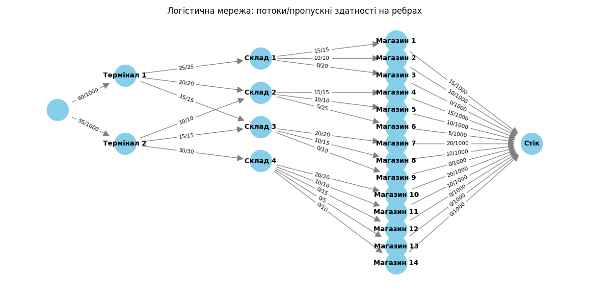

# goit-algo2-hw-03

## Завдання 1. Застосування алгоритму максимального потоку для логістики товарів

max_flow_algo.py

Для коректної роботи алгоритму Едмондса-Карпа всі магазини об'єднано у "суперстік".

### Візуалізація логістичної мережі

### Таблиця фактичних потоків між терміналами та магазинами

| Термінал   | Магазин    | Фактичний Потік (одиниць) |
| ---------- | ---------- | ------------------------- |
| Термінал 1 | Магазин 1  | 15                        |
| Термінал 1 | Магазин 2  | 10                        |
| Термінал 1 | Магазин 4  | 15                        |
| Термінал 1 | Магазин 5  | 10                        |
| Термінал 1 | Магазин 6  | 5                         |
| Термінал 1 | Магазин 7  | 20                        |
| Термінал 1 | Магазин 8  | 10                        |
| Термінал 2 | Магазин 7  | 20                        |
| Термінал 2 | Магазин 8  | 10                        |
| Термінал 2 | Магазин 10 | 20                        |
| Термінал 2 | Магазин 11 | 10                        |
| Термінал 2 | Магазин 4  | 15                        |
| Термінал 2 | Магазин 5  | 10                        |
| Термінал 2 | Магазин 6  | 5                         |

**Загальний максимальний потік:** 115 одиниць

### Аналіз результатів

1. **Які термінали забезпечують найбільший потік товарів до магазинів?**

   - Термінал 1: 60 одиниць
   - Термінал 2: 55 одиниць
     Висновок: обидва термінали активно використовуються, але Термінал 1 трохи перевищує за обсягом.

2. **Які маршрути мають найменшу пропускну здатність і як це впливає на загальний потік?**

   - Найменша пропускна здатність (<=10):
     - Склад 1 → Магазин 2: 10
     - Склад 2 → Магазин 5: 10
     - Склад 3 → Магазин 9: 10
     - Термінал 2 → Склад 2: 10
     - Склад 4 → Магазин 11: 10
     - Склад 4 → Магазин 13: 5
     - Склад 4 → Магазин 14: 10
       Вузькі місця обмежують потік до відповідних магазинів і впливають на розподіл загального потоку.

3. **Які магазини отримали найменше товарів і чи можна збільшити їх постачання, збільшивши пропускну здатність певних маршрутів?**

   - Магазини з мінімальним постачанням (0 одиниць): Магазин 3, 9, 12, 13, 14.
   - Їх постачання можна збільшити лише за умови підвищення пропускної здатності відповідних ребер у мережі.

4. **Чи є вузькі місця, які можна усунути для покращення ефективності логістичної мережі?**
   - Вузькі місця (ребра, повністю заповнені потоком):
     - Термінал 1 → Склад 1: 25
     - Термінал 1 → Склад 2: 20
     - Термінал 1 → Склад 3: 15
     - Склад 1 → Магазин 1: 15
     - Склад 1 → Магазин 2: 10
     - Склад 2 → Магазин 4: 15
     - Склад 2 → Магазин 5: 10
     - Склад 3 → Магазин 7: 20
     - Термінал 2 → Склад 3: 15
     - Термінал 2 → Склад 4: 30
     - Термінал 2 → Склад 2: 10
     - Склад 4 → Магазин 10: 20
     - Склад 4 → Магазин 11: 10
   - Усунення цих обмежень (збільшення пропускної здатності) дозволить підвищити загальний потік у мережі.

**Висновок:**

Отримані результати відповідають теоретичним знанням про максимальний потік: загальний потік визначається мінімальними пропускними здатностями на шляху від джерел до стоку, а вузькі місця обмежують постачання окремим магазинам.

## Завдання 2. Порівняння ефективності OOBTree і словника для діапазонних запитів

oobtree_vs_dict.py

**Результати тестування:**

Total range_query time for OOBTree: 0.689902 seconds  
Total range_query time for Dict: 3.718226 seconds

**Висновок:**

OOBTree демонструє значно кращу продуктивність для діапазонних запитів у порівнянні зі стандартним словником dict, якщо ключем у дереві є саме те поле, за яким виконується пошук по діапазону (у цьому випадку — Price). Це підтверджує перевагу використання OOBTree для задач, де часто потрібен пошук по діапазону значень.
